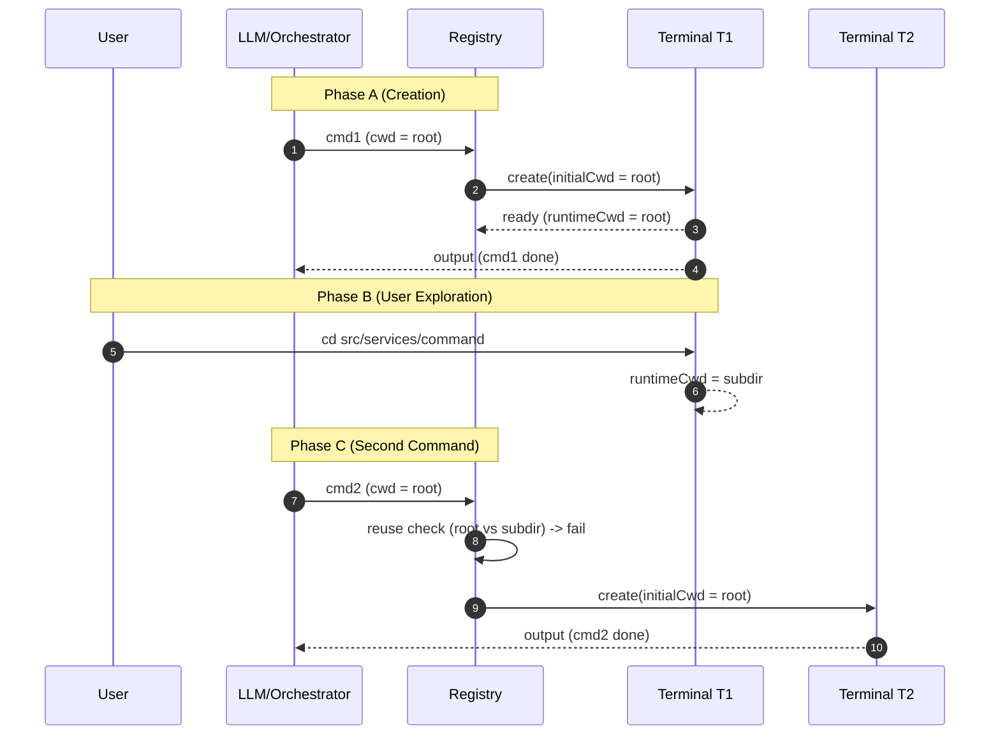
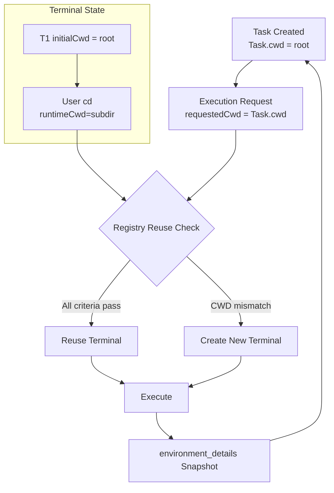
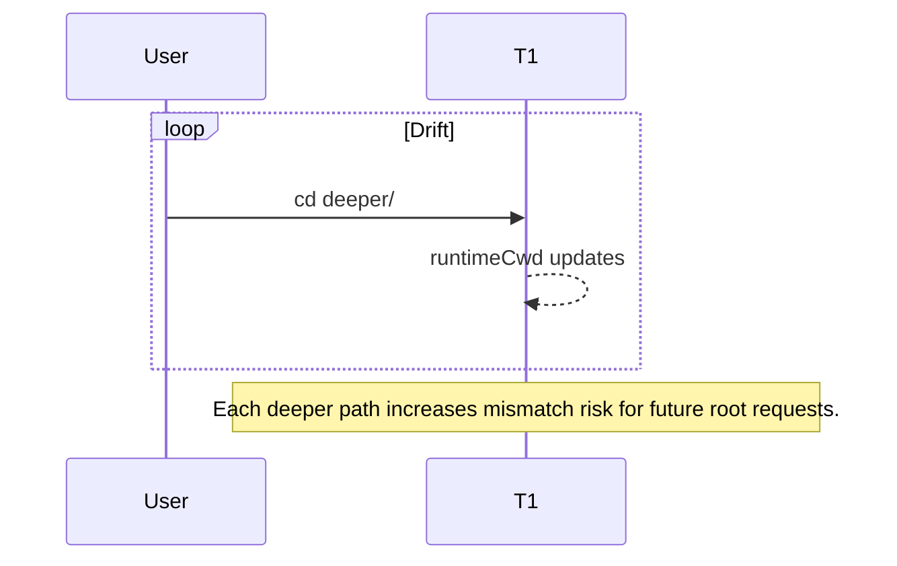

# Current Working Directory (CWD) Tracking & Terminal Reuse Architecture

This document details how the system:

- Tracks and represents the current working directory (CWD)
- Builds environment details
- Creates vs reuses terminals
- Responds to user-issued `cd`
- Produces the observed behavior: terminal reuse only when staying in the default directory

## Table of Contents

- [1. Core Components Overview](#1-core-components-overview)
- [2. Terminal Abstractions](#2-terminal-abstractions)
- [3. Working Directory Tracking Model](#3-working-directory-tracking-model)
- [4. environment_details Assembly](#4-environment_details-assembly)
- [5. Terminal Reuse Decision Logic](#5-terminal-reuse-decision-logic)
- [6. Handling User-Issued cd](#6-handling-user-issued-cd)
- [7. Observed Behavior Explanation](#7-observed-behavior-explanation)
- [8. Identified Limitations](#8-identified-limitations)
- [9. Root Cause Hypotheses (Ranked)](#9-root-cause-hypotheses-ranked)
- [10. Mitigation / Enhancement Options (Conceptual)](#10-mitigation--enhancement-options-conceptual)
- [11. Reference Inventory](#11-reference-inventory)
- [12. Key Takeaways](#12-key-takeaways)
- [13. End-to-End Scenario: Divergent CWD Triggers New Terminal](#13-end-to-end-scenario-divergent-cwd-triggers-new-terminal)

## 1. Core Components Overview

Terminal layer, task/workspace context, environment snapshot builder, and path utilities cooperate to decide when an existing terminal can be reused for a new command request.

## 2. Terminal Abstractions

| Component                                                                             | Role                            | Key Points                                                                             |
| ------------------------------------------------------------------------------------- | ------------------------------- | -------------------------------------------------------------------------------------- |
| [BaseTerminal](../src/integrations/terminal/BaseTerminal.ts#L13)                      | Base abstraction                | Immutable initialCwd (29); default getter returns it (35).                             |
| [Terminal](../src/integrations/terminal/Terminal.ts#L11)                              | VSCode-backed terminal          | Dynamic cwd (32) via shellIntegration; busy marking (44–52); env enrichment (154–167). |
| [TerminalProcess](../src/integrations/terminal/TerminalProcess.ts#L47)                | Command execution orchestration | Parses OSC 133/633 markers (~162–170, 244–249, 283–294).                               |
| [BaseTerminalProcess](../src/integrations/terminal/BaseTerminalProcess.ts#L5)         | Process primitives              | Buffers output; handles exit codes (16–33, 140–148).                                   |
| [TerminalRegistry](../src/integrations/terminal/TerminalRegistry.ts#L152)             | Creation, selection, reuse      | Events (48–124); selection (152–203); classification (232–269).                        |
| [ShellIntegrationManager](../src/integrations/terminal/ShellIntegrationManager.ts#L5) | Shell integration prep          | Temp zsh dir setup & cleanup (13–24, 69–99).                                           |
| [types](../src/integrations/terminal/types.ts#L5)                                     | Types                           | Roo terminal interface & provider semantics.                                           |

## 3. Working Directory Tracking Model

| Aspect                      | Mechanism                                                                                                           | Dynamic?     | Notes                               |
| --------------------------- | ------------------------------------------------------------------------------------------------------------------- | ------------ | ----------------------------------- |
| Initial terminal CWD        | Provided at creation in [TerminalRegistry.createTerminal](../src/integrations/terminal/TerminalRegistry.ts#L130)    | No           | Stored in initialCwd.               |
| Runtime VSCode terminal CWD | shellIntegration.cwd.fsPath via [Terminal.getCurrentWorkingDirectory](../src/integrations/terminal/Terminal.ts#L32) | Yes          | Only when shell integration active. |
| Execa provider CWD          | Base [BaseTerminal.getCurrentWorkingDirectory](../src/integrations/terminal/BaseTerminal.ts#L35)                    | No           | Immutable.                          |
| Task-level CWD              | Set during construction in [Task](../src/core/task/Task.ts#L353)                                                    | No           | Drives environment file listings.   |
| Terminal snapshot CWD       | Polled in [getEnvironmentDetails](../src/core/environment/getEnvironmentDetails.ts#L120)                            | Yes (VSCode) | Not persisted to Task.              |

No event subscription exists for CWD changes; the model is purely "poll on demand".

## 4. environment_details Assembly

Central builder: [getEnvironmentDetails](../src/core/environment/getEnvironmentDetails.ts#L31).

Sequence (representative lines):

1. Visible files (44–55) relative to `Task.cwd`.
2. Open tabs (63–77).
3. Active terminals (115–135) and inactive terminals (144–179), each polling runtime CWD through `RooTerminal.getCurrentWorkingDirectory()`.
4. Recently modified files via [FileContextTracker.getAndClearRecentlyModifiedFiles](../src/core/context-tracking/FileContextTracker.ts#L203) (186–193).
5. Time & timezone (200–208).
6. Cost & tokens (211–213, 231).
7. Mode / model metadata (243–255).
8. Optional workspace file list (279–289) using [listFiles](../src/services/glob/list-files.ts#L33) and formatted by [formatFilesList](../src/core/prompts/responses.ts#L112).
9. Reminders (295–300) via [formatReminderSection](../src/core/environment/reminder.ts#L6).

Distinction:

- File & tab listings always use static `Task.cwd`.
- Terminal sections show dynamic, possibly diverged CWD.
- No reconciliation logic merges them.

## 5. Terminal Reuse Decision Logic

Implemented in [TerminalRegistry.getOrCreateTerminal](../src/integrations/terminal/TerminalRegistry.ts#L152).

Steps:

1. Prefer a non-busy terminal from the same task with provider match and exact CWD equality (lines 162–175).
2. Else pick any non-busy terminal with provider match and exact CWD equality (lines 180–192).
3. Else create new terminal (195–199).

Equality uses [arePathsEqual](../src/utils/path.ts#L54). There is no hierarchical or fuzzy matching.

Busy state:

- Set before execution in [Terminal.runCommand](../src/integrations/terminal/Terminal.ts#L44).
- Also influenced by registry event handlers (startup & completion).
- Cleared when command ends or process finalizes.

## 6. Handling User-Issued `cd`

VSCode terminals with shell integration update `shellIntegration.cwd` immediately after an interactive `cd`.
Reuse still requests the _original_ intended execution CWD (often the root). The selection phase compares:

- Requested CWD (from new command context) vs
- Current runtime CWD (post-`cd`)

If they differ, both selection tiers fail and a new terminal is spawned.

Execa-based terminals never reflect interactive navigation (static CWD).  
Task-level CWD remains immutable; environment listings do not follow interactive navigation.

## 7. Observed Behavior Explanation

Reuse works while the user remains in the original directory because CWD equality holds. Once a `cd` changes the runtime CWD:

- Strict equality fails
- No adaptive adoption of the new path occurs
- Registry treats the scenario as a distinct execution context
- New terminal is created

## 8. Identified Limitations

- No event-driven CWD change tracking; polling only.
- No adaptive update of a task’s “active” CWD.
- Strict path equality (no ancestor/descendant tolerance).
- Mixing static (Task) and dynamic (terminal) CWDs in environment snapshot without signaling divergence.
- Execa provider cannot capture navigation.
- Potential terminal proliferation increases resource usage & user clutter.
- Busy flag timing could transiently block reuse if shell integration events lag.

## 9. Root Cause Hypotheses (Ranked)

1. Strict CWD equality in reuse algorithm is the primary driver of proliferation after `cd`.
2. Design bias toward deterministic, immutable initialCwd—avoids stale assumptions but sacrifices continuity.
3. Absence of a “task-level active CWD” concept prevents path adoption.
4. Sole reliance on shell integration (no fallback prompt parsing) widens gap when navigation occurs.
5. Lack of heuristic reuse (e.g., allow descendant paths) blocks natural iterative navigation.

## 10. Mitigation / Enhancement Options (Conceptual)

(No implementation—documentation only)

- Adaptive adoption: optionally update cached task CWD to terminal’s live CWD after successful command.
- Hierarchical tolerance: treat terminal reusable if runtime CWD is ancestor/descendant of requested CWD.
- Task-scoped pinning: favor same-task terminal regardless of CWD change unless explicitly overridden.
- Pre-command normalization: auto-issue `cd <requested>` inside existing terminal before execution instead of spawning a new one.
- Explicit API: “adopt terminal cwd” command updates Task and reuse baseline.
- Divergence surfacing: environment_details could annotate when terminal CWD differs from Task.cwd with relative delta.
- Strategy flag: STRICT | RELAXED | TASK_ONLY for reuse policy.
- Persistent last-execution CWD map keyed by task/mode for continuity.

## 11. Reference Inventory

- [BaseTerminal](../src/integrations/terminal/BaseTerminal.ts#L13)
- [Terminal](../src/integrations/terminal/Terminal.ts#L11)
- [TerminalProcess](../src/integrations/terminal/TerminalProcess.ts#L47)
- [TerminalRegistry.getOrCreateTerminal](../src/integrations/terminal/TerminalRegistry.ts#L152)
- [ShellIntegrationManager](../src/integrations/terminal/ShellIntegrationManager.ts#L5)
- [getEnvironmentDetails](../src/core/environment/getEnvironmentDetails.ts#L31)
- [arePathsEqual](../src/utils/path.ts#L54)
- [getWorkspacePath](../src/utils/path.ts#L109)
- [Task](../src/core/task/Task.ts#L353)
- [listFiles](../src/services/glob/list-files.ts#L33)
- [formatFilesList](../src/core/prompts/responses.ts#L112)
- [formatReminderSection](../src/core/environment/reminder.ts#L6)
- [FileContextTracker.getAndClearRecentlyModifiedFiles](../src/core/context-tracking/FileContextTracker.ts#L203)

## 12. Key Takeaways

- Runtime CWD is polled, not tracked or adopted.
- Reuse selection prioritizes strict path equality; task continuity is secondary.
- Interactive navigation (cd) breaks equality → new terminal creation.
- environment_details exposes divergence but does not reconcile it.
- Determinism & safety (immutable initialCWD) were prioritized over adaptive workflow continuity.

## 13. End-to-End Scenario: Divergent CWD Triggers New Terminal

> This expanded section is a self-contained guide for newcomers. It defines every term, shows how state evolves, and illustrates why a single `cd` can cascade into terminal proliferation.

### 13.1 Comprehensive Glossary

| Term                         | Plain Definition                                                  | Role in Scenario                              |
| ---------------------------- | ----------------------------------------------------------------- | --------------------------------------------- |
| Task                         | Logical unit of work (conversation, session, scripted workflow).  | Provides a stable, immutable `Task.cwd`.      |
| Task.cwd                     | The canonical directory chosen when a Task is created.            | Used for file listings & default command cwd. |
| Terminal (T1, T2, …)         | Wrapped VSCode integrated terminal instance.                      | Execution surface & reuse candidate.          |
| initialCwd                   | Value captured at terminal creation (never mutates).              | Baseline identity for a terminal.             |
| runtimeCwd                   | Live cwd from shell integration (`shellIntegration.cwd`).         | Reflects user navigation (e.g., manual `cd`). |
| Busy flag                    | Boolean marking active command execution.                         | Blocks reuse if true.                         |
| Terminal Registry            | Allocator invoked per command execution request.                  | Decides reuse vs creation.                    |
| Reuse Algorithm              | Sequence: (not busy) ∧ (provider match) ∧ (cwd equality).         | Gate controlling terminal explosion.          |
| Divergence                   | Mismatch between requested cwd (often Task.cwd) and runtimeCwd.   | Primary cause of reuse failure.               |
| CWD Drift                    | Accumulated divergence after multiple `cd` steps.                 | Increases probability of new terminals.       |
| environment_details snapshot | Diagnostic text containing Task.cwd and each terminal runtimeCwd. | Observability (no reconciliation).            |

### 13.2 Narrative Overview – “Harmony → Drift → Proliferation”

1. Harmony: Task and terminal both at root; reuse would succeed.
2. Drift: User navigates away (`cd`), altering runtimeCwd only.
3. Proliferation: Registry later compares requested root cwd vs drifted runtimeCwd; strict equality fails → new terminal spawned.

### 13.3 High-Level Lifecycle (Mermaid Sequence)



### 13.4 Architectural Data Flow



### 13.5 Phase A – Creation (Deep Dive)

| Time | Event                   | Internal Processing                     | Post-Condition                       |
| ---- | ----------------------- | --------------------------------------- | ------------------------------------ |
| t0   | Request cmd1(root)      | Registry invoked with desired cwd=root. | No terminals exist.                  |
| t1   | Create T1               | Stores `initialCwd=root`; busy=true.    | Terminal identity fixed.             |
| t2   | Shell integration ready | runtimeCwd becomes root.                | Alignment: initialCwd == runtimeCwd. |
| t3   | Command completes       | busy=false.                             | T1 eligible for reuse.               |

### 13.6 Phase B – Drift Introduction

| User Action               | Effect on runtimeCwd    | Why Task.cwd Unchanged                       |
| ------------------------- | ----------------------- | -------------------------------------------- |
| `cd src/services/command` | runtimeCwd=subdir       | Task model deliberately immutable.           |
| Additional `cd`           | runtimeCwd deeper       | Divergence widens; reuse likelihood shrinks. |
| Snapshot generation       | Shows drift (T1=subdir) | Observational only (no mutation).            |

### 13.7 Phase C – Reuse Failure Mechanics

| Step    | Check                     | Result                              |
| ------- | ------------------------- | ----------------------------------- |
| 1       | T1 not busy?              | Yes                                 |
| 2       | Provider matches?         | Yes                                 |
| 3       | requestedCwd==runtimeCwd? | root != subdir → Fail               |
| Outcome | Reuse aborted → create T2 | New terminal embodies original cwd. |

### 13.8 Detailed Timelines

#### Phase A (Aligned)

| t   | Action       | T1.runtimeCwd | Registry Decision |
| --- | ------------ | ------------- | ----------------- |
| t0  | Request cmd1 | —             | Create T1         |
| t1  | T1 created   | root          | Busy              |
| t2  | Shell ready  | root          | Still busy        |
| t3  | cmd1 done    | root          | Free              |

#### Phase B (Drift)

| t   | Action  | T1.runtimeCwd | Note              |
| --- | ------- | ------------- | ----------------- |
| t4  | User cd | subdir        | Divergence begins |

#### Phase C (Mismatch & New Terminal)

| t   | Action              | Observed             | Result                 |
| --- | ------------------- | -------------------- | ---------------------- |
| t5  | Request cmd2 (root) | T1.runtimeCwd=subdir | Compare root vs subdir |
| t6  | Reuse evaluation    | Fails equality       | Create T2              |
| t7  | cmd2 completes      | T2 busy→free         | Two terminals exist    |

### 13.9 CWD Evolution Table

| Entity              | Before cd | After cd | After T2 Creation |
| ------------------- | --------- | -------- | ----------------- |
| Task.cwd            | root      | root     | root              |
| T1.initialCwd       | root      | root     | root              |
| T1.runtimeCwd       | root      | subdir   | subdir            |
| T2.initialCwd       | —         | —        | root              |
| T2.runtimeCwd       | —         | —        | root              |
| requestedCwd (cmd2) | root      | root     | root              |

### 13.10 Failure Decision Matrix

| Criterion      | Required           | Actual (T1 at cmd2) | Pass         |
| -------------- | ------------------ | ------------------- | ------------ |
| Not Busy       | true               | true                | ✅           |
| Provider Match | same               | same                | ✅           |
| CWD Equality   | requested==runtime | root!=subdir        | ❌           |
| Overall        | all must pass      | one failed          | New terminal |

### 13.11 Drift Amplification Loop



### 13.12 Positive Alternative (Adaptive Assistant)

| Scenario                    | requestedCwd     | T1.runtimeCwd            | Reuse?    | Terminal Count |
| --------------------------- | ---------------- | ------------------------ | --------- | -------------- |
| Non-adaptive (current)      | root             | subdir                   | No        | 2              |
| Adaptive                    | subdir           | subdir                   | Yes       | 1              |
| Hypothetical “auto realign” | root (inject cd) | subdir (after injection) | Simulated | 1              |

### 13.13 Influence Sources on Effective CWD (Consolidated)

| Source                    | Mechanism                       | Can Cause Drift?             | Persistent?         |
| ------------------------- | ------------------------------- | ---------------------------- | ------------------- |
| Task initialization       | One-time assignment             | No                           | Yes (immutable)     |
| User manual navigation    | `cd` commands                   | Yes                          | Until changed again |
| Assistant command request | Uses Task.cwd unless overridden | Indirectly (by not adapting) | Per request         |
| Shell integration         | Reports live cwd                | Mirrors drift                | Continuous          |
| environment_details       | Poll & render                   | No (read-only)               | Snapshot only       |

### 13.14 Diagnostics & Observability

| Symptom                       | Interpretation        | Suggested Log                        |
| ----------------------------- | --------------------- | ------------------------------------ |
| Many similar terminals        | Frequent cwd mismatch | requested vs runtimeCwd per failure  |
| “Why new terminal?” confusion | Hidden divergence     | Emit structured reuse decision trace |
| Tests run in wrong area       | Stale requested cwd   | Log last successful runtimeCwd       |

### 13.15 FAQ (New Engineer Oriented)

| Question                                    | Answer                                                                                      |
| ------------------------------------------- | ------------------------------------------------------------------------------------------- |
| Why not auto-update Task.cwd?               | Prevents accidental global context shifts affecting file listings and path-sensitive logic. |
| Why exact equality—not ancestor/descendant? | Avoids executing in unintended monorepo sub-packages with different dependencies.           |
| Could we silently `cd` to align?            | Would hide real divergence & complicate debugging.                                          |
| Why keep initialCwd immutable?              | Provides reproducible provenance & diffable audit of terminal lifecycles.                   |
| Is terminal proliferation a bug?            | No—it's a protective consequence of strict correctness rules.                               |

### 13.16 Visual Recap (Compact)

```mermaid
flowchart LR
    Start[Task.cwd = root] --> Req1[cmd1 req (root)]
    Req1 --> T1[T1 created<br/>initialCwd=root/runtimeCwd=root]
    T1 --> Drift[User cd -> runtimeCwd=subdir]
    Drift --> Req2[cmd2 req (root)]
    Req2 --> Check{CWD Equal?}
    Check -->|Yes| Reuse[Reuse T1]
    Check -->|No| NewT2[Create T2 (root)]
    NewT2 --> Snapshot[environment_details<br/>Shows root + subdir]
    Reuse --> Snapshot
```

### 13.17 Extended Takeaways

1. Reuse = intersection of availability, provider parity, and cwd equality—remove one and creation occurs.
2. Drift is invisible to the orchestrator unless it adapts requested cwd.
3. Observability surfaces divergence; remediation is a higher-level policy decision.
4. Immutable initialCwd + mutable runtimeCwd cleanly separate “origin” vs “journey.”
5. Proliferation is a safety valve, not a defect.

_End of expanded Section 13._
