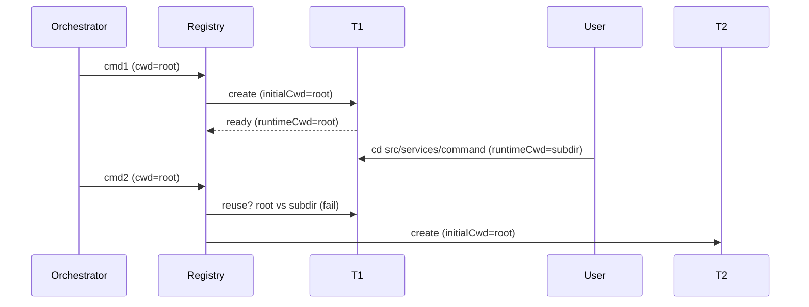

# Current Working Directory (CWD) Tracking & Terminal Reuse Architecture

This document details how the system:

- Tracks and represents the current working directory (CWD)
- Builds environment details
- Creates vs reuses terminals
- Responds to user-issued `cd`
- Produces the observed behavior: terminal reuse only when staying in the default directory

## Table of Contents

- [1. Core Components Overview](#1-core-components-overview)
- [2. Terminal Abstractions](#2-terminal-abstractions)
- [3. Working Directory Tracking Model](#3-working-directory-tracking-model)
- [4. environment_details Assembly](#4-environment_details-assembly)
- [5. Terminal Reuse Decision Logic](#5-terminal-reuse-decision-logic)
- [6. Handling User-Issued cd](#6-handling-user-issued-cd)
- [7. Observed Behavior Explanation](#7-observed-behavior-explanation)
- [8. Identified Limitations](#8-identified-limitations)
- [9. Root Cause Hypotheses (Ranked)](#9-root-cause-hypotheses-ranked)
- [10. Mitigation / Enhancement Options (Conceptual)](#10-mitigation--enhancement-options-conceptual)
- [11. Reference Inventory](#11-reference-inventory)
- [12. Key Takeaways](#12-key-takeaways)
- [13. End-to-End Scenario: Divergent CWD Triggers New Terminal](#13-end-to-end-scenario-divergent-cwd-triggers-new-terminal)

## 1. Core Components Overview

Terminal layer, task/workspace context, environment snapshot builder, and path utilities cooperate to decide when an existing terminal can be reused for a new command request.

## 2. Terminal Abstractions

| Component                                                                             | Role                            | Key Points                                                                             |
| ------------------------------------------------------------------------------------- | ------------------------------- | -------------------------------------------------------------------------------------- |
| [BaseTerminal](../src/integrations/terminal/BaseTerminal.ts#L13)                      | Base abstraction                | Immutable initialCwd (29); default getter returns it (35).                             |
| [Terminal](../src/integrations/terminal/Terminal.ts#L11)                              | VSCode-backed terminal          | Dynamic cwd (32) via shellIntegration; busy marking (44–52); env enrichment (154–167). |
| [TerminalProcess](../src/integrations/terminal/TerminalProcess.ts#L47)                | Command execution orchestration | Parses OSC 133/633 markers (~162–170, 244–249, 283–294).                               |
| [BaseTerminalProcess](../src/integrations/terminal/BaseTerminalProcess.ts#L5)         | Process primitives              | Buffers output; handles exit codes (16–33, 140–148).                                   |
| [TerminalRegistry](../src/integrations/terminal/TerminalRegistry.ts#L152)             | Creation, selection, reuse      | Events (48–124); selection (152–203); classification (232–269).                        |
| [ShellIntegrationManager](../src/integrations/terminal/ShellIntegrationManager.ts#L5) | Shell integration prep          | Temp zsh dir setup & cleanup (13–24, 69–99).                                           |
| [types](../src/integrations/terminal/types.ts#L5)                                     | Types                           | Roo terminal interface & provider semantics.                                           |

## 3. Working Directory Tracking Model

| Aspect                      | Mechanism                                                                                                           | Dynamic?     | Notes                               |
| --------------------------- | ------------------------------------------------------------------------------------------------------------------- | ------------ | ----------------------------------- |
| Initial terminal CWD        | Provided at creation in [TerminalRegistry.createTerminal](../src/integrations/terminal/TerminalRegistry.ts#L130)    | No           | Stored in initialCwd.               |
| Runtime VSCode terminal CWD | shellIntegration.cwd.fsPath via [Terminal.getCurrentWorkingDirectory](../src/integrations/terminal/Terminal.ts#L32) | Yes          | Only when shell integration active. |
| Execa provider CWD          | Base [BaseTerminal.getCurrentWorkingDirectory](../src/integrations/terminal/BaseTerminal.ts#L35)                    | No           | Immutable.                          |
| Task-level CWD              | Set during construction in [Task](../src/core/task/Task.ts#L353)                                                    | No           | Drives environment file listings.   |
| Terminal snapshot CWD       | Polled in [getEnvironmentDetails](../src/core/environment/getEnvironmentDetails.ts#L120)                            | Yes (VSCode) | Not persisted to Task.              |

No event subscription exists for CWD changes; the model is purely "poll on demand".

### 3.1 Command-Level requestedCwd vs Task.cwd

| Aspect                | Task.cwd (Task constructor)                                             | requestedCwd (per command)                                                       | runtimeCwd (terminal live)                                                                                          |
| --------------------- | ----------------------------------------------------------------------- | -------------------------------------------------------------------------------- | ------------------------------------------------------------------------------------------------------------------- |
| Source                | Set once when creating the Task ([Task](../src/core/task/Task.ts#L353)) | Provided with each execution request (defaults to Task.cwd if omitted)           | Polled from shell integration ([Terminal.getCurrentWorkingDirectory](../src/integrations/terminal/Terminal.ts#L32)) |
| Mutability            | Immutable (no setter / adoption path)                                   | Mutable across commands (caller-controlled each time)                            | Changes interactively via user `cd`                                                                                 |
| Persistence           | Lasts for life of Task instance                                         | Exists only for the duration of that single command request                      | Ephemeral snapshot at poll time                                                                                     |
| Side Effects          | Drives file/tab listings & default execution context                    | Overrides default execution directory for that command only                      | Influences reuse equality check; does NOT mutate Task.cwd or future requestedCwd                                    |
| Can it update others? | N/A                                                                     | Does NOT write back to Task.cwd                                                  | No automatic propagation into Task.cwd or future requestedCwd                                                       |
| Adoption Mechanism    | None implemented                                                        | Explicit future commands must re-specify a new cwd to shift context persistently | Would need a (non-existent) “adopt” API to influence canonical context                                              |

Key points:

- Changing directories inside a terminal (runtimeCwd) never updates Task.cwd.
- A later command can supply a different requestedCwd; this does not retroactively alter earlier commands or Task.cwd.
- There is currently no API that promotes runtimeCwd → Task.cwd.
- Effective execution path per command = requestedCwd || Task.cwd (if unspecified).

## 4. environment_details Assembly

Central builder: [getEnvironmentDetails](../src/core/environment/getEnvironmentDetails.ts#L31).

Sequence (representative lines):

1. Visible files (44–55) relative to `Task.cwd`.
2. Open tabs (63–77).
3. Active terminals (115–135) and inactive terminals (144–179), each polling runtime CWD through `RooTerminal.getCurrentWorkingDirectory()`.
4. Recently modified files via [FileContextTracker.getAndClearRecentlyModifiedFiles](../src/core/context-tracking/FileContextTracker.ts#L203) (186–193).
5. Time & timezone (200–208).
6. Cost & tokens (211–213, 231).
7. Mode / model metadata (243–255).
8. Optional workspace file list (279–289) using [listFiles](../src/services/glob/list-files.ts#L33) and formatted by [formatFilesList](../src/core/prompts/responses.ts#L112).
9. Reminders (295–300) via [formatReminderSection](../src/core/environment/reminder.ts#L6).

Distinction:

- File & tab listings always use static `Task.cwd`.
- Terminal sections show dynamic, possibly diverged CWD.
- No reconciliation logic merges them.

## 5. Terminal Reuse Decision Logic

Implemented in [TerminalRegistry.getOrCreateTerminal](../src/integrations/terminal/TerminalRegistry.ts#L152).

Steps:

1. Prefer a non-busy terminal from the same task with provider match and exact CWD equality (lines 162–175).
2. Else pick any non-busy terminal with provider match and exact CWD equality (lines 180–192).
3. Else create new terminal (195–199).

Equality uses [arePathsEqual](../src/utils/path.ts#L54). There is no hierarchical or fuzzy matching.

Busy state:

- Set before execution in [Terminal.runCommand](../src/integrations/terminal/Terminal.ts#L44).
- Also influenced by registry event handlers (startup & completion).
- Cleared when command ends or process finalizes.

## 6. Handling User-Issued `cd`

VSCode terminals with shell integration update `shellIntegration.cwd` immediately after an interactive `cd`.
Reuse still requests the _original_ intended execution CWD (often the root). The selection phase compares:

- Requested CWD (from new command context) vs
- Current runtime CWD (post-`cd`)

If they differ, both selection tiers fail and a new terminal is spawned.

Execa-based terminals never reflect interactive navigation (static CWD).  
Task-level CWD remains immutable; environment listings do not follow interactive navigation.

## 7. Observed Behavior Explanation

Reuse works while the user remains in the original directory because CWD equality holds. Once a `cd` changes the runtime CWD:

- Strict equality fails
- No adaptive adoption of the new path occurs
- Registry treats the scenario as a distinct execution context
- New terminal is created

## 8. Identified Limitations

- No event-driven CWD change tracking; polling only.
- No adaptive update of a task’s “active” CWD.
- Strict path equality (no ancestor/descendant tolerance).
- Mixing static (Task) and dynamic (terminal) CWDs in environment snapshot without signaling divergence.
- Execa provider cannot capture navigation.
- Potential terminal proliferation increases resource usage & user clutter.
- Busy flag timing could transiently block reuse if shell integration events lag.

## 9. Root Cause Hypotheses (Ranked)

1. Strict CWD equality in reuse algorithm is the primary driver of proliferation after `cd`.
2. Design bias toward deterministic, immutable initialCwd—avoids stale assumptions but sacrifices continuity.
3. Absence of a “task-level active CWD” concept prevents path adoption.
4. Sole reliance on shell integration (no fallback prompt parsing) widens gap when navigation occurs.
5. Lack of heuristic reuse (e.g., allow descendant paths) blocks natural iterative navigation.

## 10. Mitigation / Enhancement Options (Conceptual)

(No implementation—documentation only)

- Adaptive adoption: optionally update cached task CWD to terminal’s live CWD after successful command.
- Hierarchical tolerance: treat terminal reusable if runtime CWD is ancestor/descendant of requested CWD.
- Task-scoped pinning: favor same-task terminal regardless of CWD change unless explicitly overridden.
- Pre-command normalization: auto-issue `cd <requested>` inside existing terminal before execution instead of spawning a new one.
- Explicit API: “adopt terminal cwd” command updates Task and reuse baseline.
- Divergence surfacing: environment_details could annotate when terminal CWD differs from Task.cwd with relative delta.
- Strategy flag: STRICT | RELAXED | TASK_ONLY for reuse policy.
- Persistent last-execution CWD map keyed by task/mode for continuity.

## 11. Reference Inventory

- [BaseTerminal](../src/integrations/terminal/BaseTerminal.ts#L13)
- [Terminal](../src/integrations/terminal/Terminal.ts#L11)
- [TerminalProcess](../src/integrations/terminal/TerminalProcess.ts#L47)
- [TerminalRegistry.getOrCreateTerminal](../src/integrations/terminal/TerminalRegistry.ts#L152)
- [ShellIntegrationManager](../src/integrations/terminal/ShellIntegrationManager.ts#L5)
- [getEnvironmentDetails](../src/core/environment/getEnvironmentDetails.ts#L31)
- [arePathsEqual](../src/utils/path.ts#L54)
- [getWorkspacePath](../src/utils/path.ts#L109)
- [Task](../src/core/task/Task.ts#L353)
- [listFiles](../src/services/glob/list-files.ts#L33)
- [formatFilesList](../src/core/prompts/responses.ts#L112)
- [formatReminderSection](../src/core/environment/reminder.ts#L6)
- [FileContextTracker.getAndClearRecentlyModifiedFiles](../src/core/context-tracking/FileContextTracker.ts#L203)

## 12. Key Takeaways

- Runtime CWD is polled, not tracked or adopted.
- Reuse selection prioritizes strict path equality; task continuity is secondary.
- Interactive navigation (cd) breaks equality → new terminal creation.
- environment_details exposes divergence but does not reconcile it.
- Determinism & safety (immutable initialCWD) were prioritized over adaptive workflow continuity.

## 13. End-to-End Scenario: Divergent CWD Triggers New Terminal (Compressed)

A concise view of why a single `cd` causes a new terminal under strict equality.

### 13.1 Key Terms (Minimal)

| Term           | Summary                                          |
| -------------- | ------------------------------------------------ |
| Task.cwd       | Immutable canonical task directory.              |
| requestedCwd   | Per-command override (defaults to Task.cwd).     |
| initialCwd     | Terminal creation directory (immutable).         |
| runtimeCwd     | Live terminal directory (user `cd` updates).     |
| Divergence     | requestedCwd ≠ runtimeCwd.                       |
| Reuse Criteria | Not busy ∧ provider match ∧ exact path equality. |

### 13.2 Single Sequence

### 13.3 Consolidated Timeline

| t   | Event        | requestedCwd | T1.runtimeCwd | Decision       |
| --- | ------------ | ------------ | ------------- | -------------- |
| t0  | cmd1 request | root         | —             | Create T1      |
| t1  | T1 ready     | root         | root          | Reusable       |
| t2  | User cd      | —            | subdir        | Drift starts   |
| t3  | cmd2 request | root         | subdir        | Equality fails |
| t4  | Reuse check  | root         | subdir        | New T2         |

### 13.4 Reuse Failure Matrix

| Criterion      | Needed             | Observed     | Pass         |
| -------------- | ------------------ | ------------ | ------------ |
| Not busy       | true               | true         | Yes          |
| Provider match | same               | same         | Yes          |
| CWD equality   | requested==runtime | root!=subdir | No           |
| Overall        | all pass           | one failed   | New terminal |

### 13.5 State Evolution

| Entity              | Initial | After cd | After T2 |
| ------------------- | ------- | -------- | -------- |
| Task.cwd            | root    | root     | root     |
| T1.initialCwd       | root    | root     | root     |
| T1.runtimeCwd       | root    | subdir   | subdir   |
| T2.initialCwd       | —       | —        | root     |
| requestedCwd (cmd2) | root    | root     | root     |

### 13.6 Signals

| Signal                                       | Interpretation                         |
| -------------------------------------------- | -------------------------------------- |
| Growing terminal list                        | Repeated divergence events             |
| Tests in wrong subtree                       | Orchestrator not updating requestedCwd |
| Frequent root commands after deep navigation | Predictable proliferation              |

### 13.7 Essential Mechanics

- runtimeCwd never mutates Task.cwd.
- requestedCwd is per-request; caller must adapt manually.
- Strict equality only; no ancestor/descendant tolerance.
- New terminal creation is intentional safety.

### 13.8 Condensed Takeaways

1. Reuse hinges on exact path equality after availability/provider checks.
2. Drift is observational only—no adoption layer.
3. Minimizing proliferation requires updating requestedCwd.
4. Adding heuristic matching or an adopt API are the levers for change.
5. Safety preference > implicit adaptation.

_End of Section 13 (compressed)._

_End of expanded Section 13._
