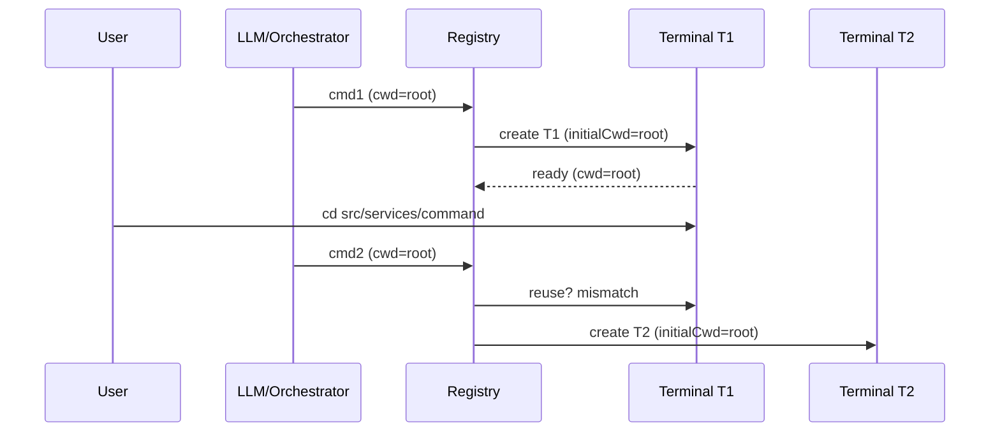

# Current Working Directory (CWD) Tracking & Terminal Reuse Architecture

This document details how the system:

- Tracks and represents the current working directory (CWD)
- Builds environment details
- Creates vs reuses terminals
- Responds to user-issued `cd`
- Produces the observed behavior: terminal reuse only when staying in the default directory

## Table of Contents

- [1. Core Components Overview](#1-core-components-overview)
- [2. Terminal Abstractions](#2-terminal-abstractions)
- [3. Working Directory Tracking Model](#3-working-directory-tracking-model)
- [4. environment_details Assembly](#4-environment_details-assembly)
- [5. Terminal Reuse Decision Logic](#5-terminal-reuse-decision-logic)
- [6. Handling User-Issued cd](#6-handling-user-issued-cd)
- [7. Observed Behavior Explanation](#7-observed-behavior-explanation)
- [8. Identified Limitations](#8-identified-limitations)
- [9. Root Cause Hypotheses (Ranked)](#9-root-cause-hypotheses-ranked)
- [10. Mitigation / Enhancement Options (Conceptual)](#10-mitigation--enhancement-options-conceptual)
- [11. Reference Inventory](#11-reference-inventory)
- [12. Key Takeaways](#12-key-takeaways)
- [13. End-to-End Scenario: Divergent CWD Triggers New Terminal](#13-end-to-end-scenario-divergent-cwd-triggers-new-terminal)

## 1. Core Components Overview

Terminal layer, task/workspace context, environment snapshot builder, and path utilities cooperate to decide when an existing terminal can be reused for a new command request.

## 2. Terminal Abstractions

| Component                                                                         | Role                            | Key Points                                                                             |
| --------------------------------------------------------------------------------- | ------------------------------- | -------------------------------------------------------------------------------------- |
| [BaseTerminal](src/integrations/terminal/BaseTerminal.ts:13)                      | Base abstraction                | Immutable initialCwd (29); default getter returns it (35).                             |
| [Terminal](src/integrations/terminal/Terminal.ts:11)                              | VSCode-backed terminal          | Dynamic cwd (32) via shellIntegration; busy marking (44–52); env enrichment (154–167). |
| [TerminalProcess](src/integrations/terminal/TerminalProcess.ts:47)                | Command execution orchestration | Parses OSC 133/633 markers (~162–170, 244–249, 283–294).                               |
| [BaseTerminalProcess](src/integrations/terminal/BaseTerminalProcess.ts:5)         | Process primitives              | Buffers output; handles exit codes (16–33, 140–148).                                   |
| [TerminalRegistry](src/integrations/terminal/TerminalRegistry.ts:152)             | Creation, selection, reuse      | Events (48–124); selection (152–203); classification (232–269).                        |
| [ShellIntegrationManager](src/integrations/terminal/ShellIntegrationManager.ts:5) | Shell integration prep          | Temp zsh dir setup & cleanup (13–24, 69–99).                                           |
| [types](src/integrations/terminal/types.ts:5)                                     | Types                           | Roo terminal interface & provider semantics.                                           |

## 3. Working Directory Tracking Model

| Aspect                      | Mechanism                                                                                                       | Dynamic?     | Notes                               |
| --------------------------- | --------------------------------------------------------------------------------------------------------------- | ------------ | ----------------------------------- |
| Initial terminal CWD        | Provided at creation in [TerminalRegistry.createTerminal](src/integrations/terminal/TerminalRegistry.ts:130)    | No           | Stored in initialCwd.               |
| Runtime VSCode terminal CWD | shellIntegration.cwd.fsPath via [Terminal.getCurrentWorkingDirectory](src/integrations/terminal/Terminal.ts:32) | Yes          | Only when shell integration active. |
| Execa provider CWD          | Base [BaseTerminal.getCurrentWorkingDirectory](src/integrations/terminal/BaseTerminal.ts:35)                    | No           | Immutable.                          |
| Task-level CWD              | Set during construction in [Task](src/core/task/Task.ts:353)                                                    | No           | Drives environment file listings.   |
| Terminal snapshot CWD       | Polled in [getEnvironmentDetails](src/core/environment/getEnvironmentDetails.ts:120)                            | Yes (VSCode) | Not persisted to Task.              |

No event subscription exists for CWD changes; the model is purely "poll on demand".

## 4. environment_details Assembly

Central builder: [getEnvironmentDetails](src/core/environment/getEnvironmentDetails.ts:31).

Sequence (representative lines):

1. Visible files (44–55) relative to `Task.cwd`.
2. Open tabs (63–77).
3. Active terminals (115–135) and inactive terminals (144–179), each polling runtime CWD through `RooTerminal.getCurrentWorkingDirectory()`.
4. Recently modified files via [FileContextTracker.getAndClearRecentlyModifiedFiles](src/core/context-tracking/FileContextTracker.ts:203) (186–193).
5. Time & timezone (200–208).
6. Cost & tokens (211–213, 231).
7. Mode / model metadata (243–255).
8. Optional workspace file list (279–289) using [listFiles](src/services/glob/list-files.ts:33) and formatted by [formatFilesList](src/core/prompts/responses.ts:112).
9. Reminders (295–300) via [formatReminderSection](src/core/environment/reminder.ts:6).

Distinction:

- File & tab listings always use static `Task.cwd`.
- Terminal sections show dynamic, possibly diverged CWD.
- No reconciliation logic merges them.

## 5. Terminal Reuse Decision Logic

Implemented in [TerminalRegistry.getOrCreateTerminal](src/integrations/terminal/TerminalRegistry.ts:152).

Steps:

1. Prefer a non-busy terminal from the same task with provider match and exact CWD equality (lines 162–175).
2. Else pick any non-busy terminal with provider match and exact CWD equality (lines 180–192).
3. Else create new terminal (195–199).

Equality uses [arePathsEqual](src/utils/path.ts:54). There is no hierarchical or fuzzy matching.

Busy state:

- Set before execution in [Terminal.runCommand](src/integrations/terminal/Terminal.ts:44).
- Also influenced by registry event handlers (startup & completion).
- Cleared when command ends or process finalizes.

## 6. Handling User-Issued `cd`

VSCode terminals with shell integration update `shellIntegration.cwd` immediately after an interactive `cd`.
Reuse still requests the _original_ intended execution CWD (often the root). The selection phase compares:

- Requested CWD (from new command context) vs
- Current runtime CWD (post-`cd`)

If they differ, both selection tiers fail and a new terminal is spawned.

Execa-based terminals never reflect interactive navigation (static CWD).  
Task-level CWD remains immutable; environment listings do not follow interactive navigation.

## 7. Observed Behavior Explanation

Reuse works while the user remains in the original directory because CWD equality holds. Once a `cd` changes the runtime CWD:

- Strict equality fails
- No adaptive adoption of the new path occurs
- Registry treats the scenario as a distinct execution context
- New terminal is created

## 8. Identified Limitations

- No event-driven CWD change tracking; polling only.
- No adaptive update of a task’s “active” CWD.
- Strict path equality (no ancestor/descendant tolerance).
- Mixing static (Task) and dynamic (terminal) CWDs in environment snapshot without signaling divergence.
- Execa provider cannot capture navigation.
- Potential terminal proliferation increases resource usage & user clutter.
- Busy flag timing could transiently block reuse if shell integration events lag.

## 9. Root Cause Hypotheses (Ranked)

1. Strict CWD equality in reuse algorithm is the primary driver of proliferation after `cd`.
2. Design bias toward deterministic, immutable initialCwd—avoids stale assumptions but sacrifices continuity.
3. Absence of a “task-level active CWD” concept prevents path adoption.
4. Sole reliance on shell integration (no fallback prompt parsing) widens gap when navigation occurs.
5. Lack of heuristic reuse (e.g., allow descendant paths) blocks natural iterative navigation.

## 10. Mitigation / Enhancement Options (Conceptual)

(No implementation—documentation only)

- Adaptive adoption: optionally update cached task CWD to terminal’s live CWD after successful command.
- Hierarchical tolerance: treat terminal reusable if runtime CWD is ancestor/descendant of requested CWD.
- Task-scoped pinning: favor same-task terminal regardless of CWD change unless explicitly overridden.
- Pre-command normalization: auto-issue `cd <requested>` inside existing terminal before execution instead of spawning a new one.
- Explicit API: “adopt terminal cwd” command updates Task and reuse baseline.
- Divergence surfacing: environment_details could annotate when terminal CWD differs from Task.cwd with relative delta.
- Strategy flag: STRICT | RELAXED | TASK_ONLY for reuse policy.
- Persistent last-execution CWD map keyed by task/mode for continuity.

## 11. Reference Inventory

- [BaseTerminal](src/integrations/terminal/BaseTerminal.ts:13)
- [Terminal](src/integrations/terminal/Terminal.ts:11)
- [TerminalProcess](src/integrations/terminal/TerminalProcess.ts:47)
- [TerminalRegistry.getOrCreateTerminal](src/integrations/terminal/TerminalRegistry.ts:152)
- [ShellIntegrationManager](src/integrations/terminal/ShellIntegrationManager.ts:5)
- [getEnvironmentDetails](src/core/environment/getEnvironmentDetails.ts:31)
- [arePathsEqual](src/utils/path.ts:54)
- [getWorkspacePath](src/utils/path.ts:109)
- [Task](src/core/task/Task.ts:353)
- [listFiles](src/services/glob/list-files.ts:33)
- [formatFilesList](src/core/prompts/responses.ts:112)
- [formatReminderSection](src/core/environment/reminder.ts:6)
- [FileContextTracker.getAndClearRecentlyModifiedFiles](src/core/context-tracking/FileContextTracker.ts:203)

## 12. Key Takeaways

- Runtime CWD is polled, not tracked or adopted.
- Reuse selection prioritizes strict path equality; task continuity is secondary.
- Interactive navigation (cd) breaks equality → new terminal creation.
- environment_details exposes divergence but does not reconcile it.
- Determinism & safety (immutable initialCWD) were prioritized over adaptive workflow continuity.

## 13. End-to-End Scenario: Divergent CWD Triggers New Terminal

### 13.1 Actors

- User (interactive terminal usage)
- LLM / Orchestrator issuing an execute request
- Terminal registry: [TerminalRegistry.getOrCreateTerminal](src/integrations/terminal/TerminalRegistry.ts:152)
- VSCode terminal wrapper: [Terminal](src/integrations/terminal/Terminal.ts:11)
- Environment snapshot builder: [getEnvironmentDetails](src/core/environment/getEnvironmentDetails.ts:31)

### 13.2 Initial Preconditions

1. Workspace root: `/home/matt/code/system/kilocode`
2. Task created with `Task.cwd = /home/matt/code/system/kilocode` ([Task](src/core/task/Task.ts:353))
3. First command request arrives from LLM: `npm run build` (implicit cwd = Task.cwd)
4. No existing terminals; registry must create one.

### 13.3 Phase A: First Command (Terminal Creation & Execution)

Steps:

1. Orchestrator requests execution with cwd = root.
2. Registry calls creation path → new VSCode terminal T1 with `initialCwd = root`.
3. T1 starts; shell integration activates; `shellIntegration.cwd = root`.
4. Command runs; on completion busy flag cleared.
5. environment_details snapshot:
    - Files/tabs anchored to Task.cwd (root).
    - Terminal section shows T1 cwd = root.

State Timeline (A):

| Time | Event                      | Terminals          |
| ---- | -------------------------- | ------------------ |
| t0   | Request(cmd1, cwd=root)    | []                 |
| t1   | Create T1(initialCwd=root) | T1: cwd=root, busy |
| t2   | shellIntegration ready     | T1: cwd=root, busy |
| t3   | cmd1 completes             | T1: cwd=root, free |

### 13.4 Phase B: User Manually Changes Directory

User manually runs inside T1:

```
cd src/services/command
```

Shell integration updates runtime cwd:

- T1.runtimeCwd = `/home/matt/code/system/kilocode/src/services/command`
- `initialCwd` remains root (immutable)

environment_details now (if generated):

- Task.cwd: root (unchanged)
- Terminal listing: T1 cwd = `.../src/services/command`
- Divergence not reconciled.

### 13.5 Phase C: Second LLM Command (Reuse Succeeds or Fails?)

Case 1 (would reuse): If LLM also sets cwd = the new path.
Case 2 (actual problematic path): LLM still requests cwd = root.

We are modeling Case 2.

Steps:

1. Orchestrator requests cmd2: `npm test` with cwd = root (it still believes root is correct context).
2. Registry selection algorithm (Lines 162–175 then 180–192):
    - Candidate T1 (same task, provider match) BUT:
    - Equality check: requested cwd (root) vs T1.getCurrentWorkingDirectory() (shellIntegration cwd = subdir) → mismatch.
3. No other matching terminal with exact cwd.
4. Registry creates new terminal T2 with `initialCwd = root`.
5. cmd2 executed in T2.

State Timeline (B/C Reuse Failure):

| Time | Event                                  | Terminals                                |
| ---- | -------------------------------------- | ---------------------------------------- |
| t4   | User: cd src/services/command          | T1: cwd=subdir, free                     |
| t5   | Request(cmd2, cwd=root)                | T1: cwd=subdir, free                     |
| t6   | Reuse evaluation: mismatch → create T2 | T1: cwd=subdir, free; T2: cwd=root, busy |
| t7   | cmd2 completes                         | T1: cwd=subdir, free; T2: cwd=root, free |

### 13.6 ASCII Sequence Diagram

Creation + Divergence + New Terminal:



Simplified ASCII flow:

```
cmd1 @ root --> T1(created)
user: cd src/services/command  (T1 cwd=subdir)
cmd2 requested @ root -> mismatch with T1(subdir) -> create T2
```

Legend:

- Reuse failure hinge: strict path equality (root vs subdir).

### 13.7 Decision Points

| Decision                        | Code Location                                                                             | Input                            | Outcome         |
| ------------------------------- | ----------------------------------------------------------------------------------------- | -------------------------------- | --------------- |
| Candidate selection (same-task) | [TerminalRegistry.getOrCreateTerminal](src/integrations/terminal/TerminalRegistry.ts:152) | requested cwd vs T1 current cwd  | Fails: mismatch |
| Fallback pool search            | Same method lines 180–192                                                                 | Any free terminal with exact cwd | None found      |
| Terminal creation               | Lines 195–199                                                                             | Need new context                 | T2 created      |

### 13.8 Influence Sources on Effective CWD

| Source                | Influence Mechanism                    | Resulting CWD Used                            |
| --------------------- | -------------------------------------- | --------------------------------------------- |
| Task initialization   | Sets static Task.cwd                   | Basis for file listings & default command cwd |
| User `cd` in terminal | Updates shellIntegration.cwd (dynamic) | Affects reuse comparison only                 |
| LLM command request   | Carries desired cwd (often Task.cwd)   | Drives registry requested cwd                 |
| environment_details   | Polls dynamic terminal cwd             | Displays divergence; does not feed back       |
| Path equality util    | [arePathsEqual](src/utils/path.ts:54)  | Enforces strict exact match                   |

### 13.9 Edge / Variant Cases

| Variant                          | Effect                                                         |
| -------------------------------- | -------------------------------------------------------------- |
| LLM adapts cwd to subdir         | T1 reused; no new terminal                                     |
| User cd back to root before cmd2 | T1 reused (cwd equality restored)                              |
| Multiple cascading cd operations | Each subsequent root-based request spawns yet another terminal |
| Execa provider usage             | No dynamic divergence; reuse more stable (always initialCwd)   |

### 13.10 Failure Signals (Indirect)

- Terminal proliferation visible in environment_details listing.
- Increased resource usage (more terminal objects tracked).
- Divergence not signaled explicitly; user infers from multiple terminals.

### 13.11 Summary of Scenario Dynamics

A single interactive navigation step by the user (cd) desynchronizes runtime terminal state from orchestrator assumptions. Because reuse logic requires exact cwd match and never mutates canonical task cwd, future commands revert to spawning new terminals until either:

- The orchestrator updates requested cwd, or
- The user manually returns terminal cwd to the original path.

End of document.
